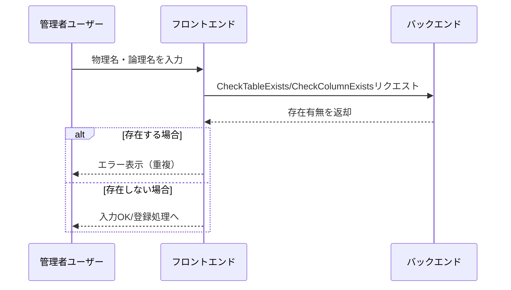
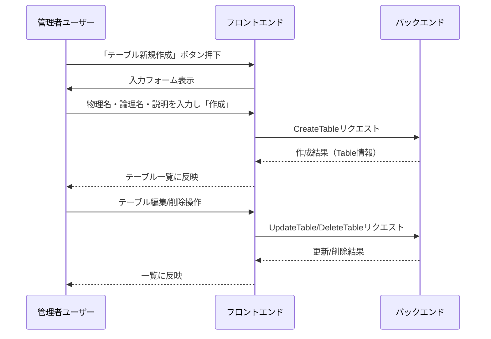
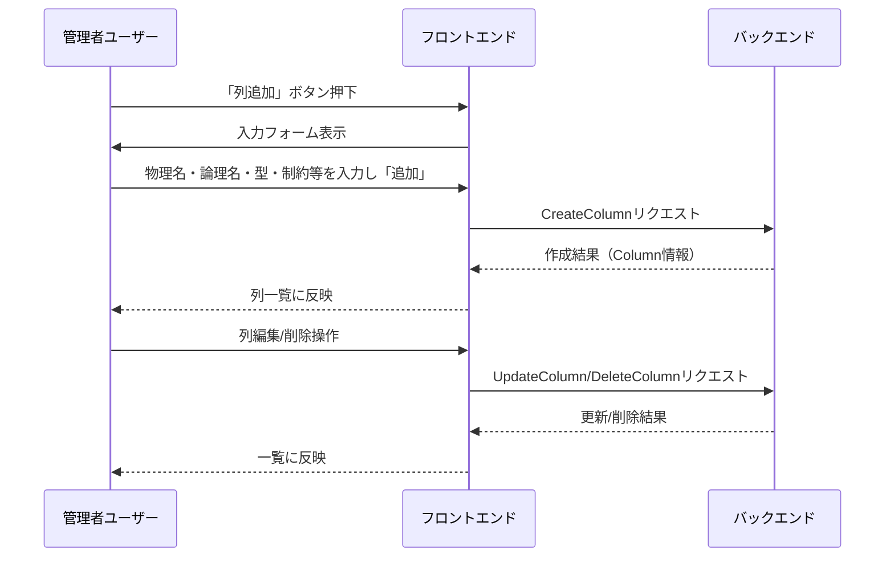
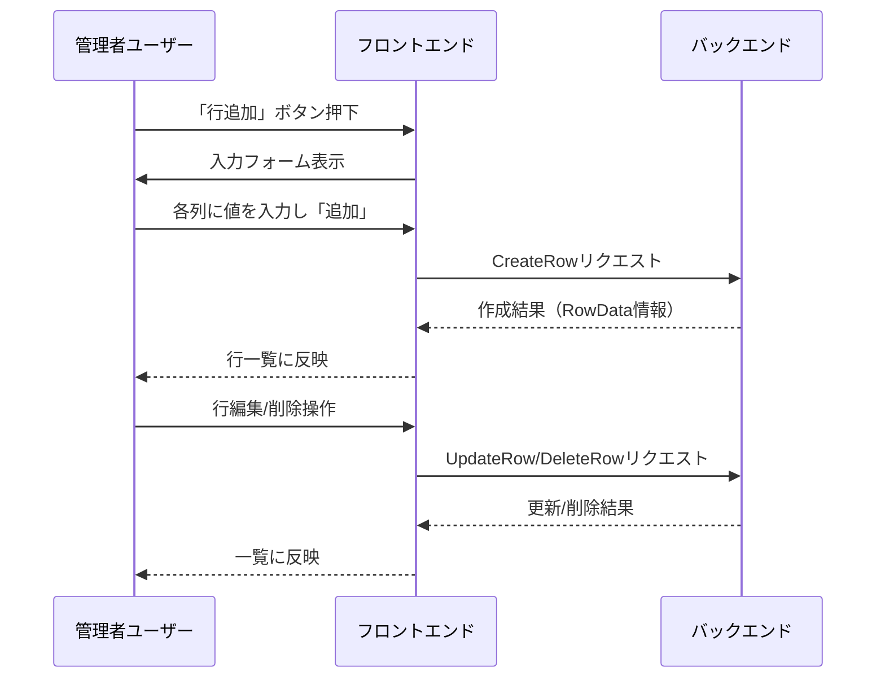

# テーブル管理機能

---

## カテゴリ

設計書

---
## 概要
テーブル管理機能は、アプリケーション内で利用する各種テーブルの構造（テーブル・列・行データ）をgRPC経由で管理する機能です。
テーブル・列・行データそれぞれに対し、作成・編集・削除が可能です。また、物理名・論理名の両方を管理対象とします。

## 主なユースケース
- テーブル一覧の取得・作成・編集・削除（物理名・論理名の管理）
- テーブル名の存在チェック（重複確認）
- テーブルに対する列（カラム）の追加・編集・削除（物理名・論理名の管理）
- 列名の存在チェック（重複確認）
- テーブルに対する行データの追加・編集・削除

## ユーザーシナリオ

### シナリオ0: テーブル名・列名の存在チェック
1. 管理者ユーザーがテーブル新規作成や列追加画面で物理名・論理名を入力する。
2. 入力時または「作成」ボタン押下時に、同名のテーブルや列が既に存在しないかバックエンドに問い合わせる。
3. 存在する場合はエラー表示し、登録不可とする。
4. 存在しない場合は登録処理へ進む。

---

## ユーザーシナリオ（マーメイド図）

### シナリオ0: テーブル名・列名の存在チェック

### シナリオ1: テーブルの作成・編集・削除

### シナリオ2: 列（カラム）の追加・編集・削除

### シナリオ3: 行データの追加・編集・削除

### シナリオ1: テーブルの作成・編集・削除
1. 管理者ユーザーが「テーブル新規作成」ボタンをクリック。
2. テーブルの物理名・論理名・説明を入力し「作成」ボタンを押す。
3. テーブル一覧に新しいテーブルが追加される。
4. 一覧から編集したいテーブルを選択し、物理名・論理名・説明を修正して保存できる。
5. テーブルの「削除」ボタンでテーブルを削除できる。

### シナリオ2: 列（カラム）の追加・編集・削除
1. テーブル詳細画面で「列追加」ボタンをクリック。
2. 列の物理名・論理名・型・制約等を入力し「追加」ボタンを押す。
3. テーブルに新しい列が追加される。
4. 既存列の編集・削除も可能。

### シナリオ3: 行データの追加・編集・削除
1. テーブル詳細画面で「行追加」ボタンをクリック。
2. 各列に対応する値を入力し「追加」ボタンを押す。
3. 行データが追加される。
4. 既存行の編集・削除も可能。

- Table
  - id: int64
  - physical_name: string   # 物理名
  - logical_name: string    # 論理名
  - description: string
  - created_at: string (ISO8601)
  - updated_at: string (ISO8601)
  - columns: [Column]
- Column
  - id: int64
  - table_id: int64
  - physical_name: string   # 物理名
  - logical_name: string    # 論理名
  - data_type: string
  - constraints: string
  - description: string
  - created_at: string (ISO8601)
  - updated_at: string (ISO8601)
- RowData
  - id: int64
  - table_id: int64
  - values: map<string, any>  # 列物理名→値のマップ
  - created_at: string (ISO8601)
  - updated_at: string (ISO8601)

## 画面構成

### 1. テーブル一覧画面
- テーブルの一覧表示（物理名・論理名・説明・作成日・更新日）
- フィルタリング機能（物理名・論理名・説明などでの絞り込み）
- 「新規作成」ボタン
- 各テーブルの「詳細」「編集」「削除」ボタン

### 2. テーブル作成・編集画面
- 物理名・論理名・説明の入力欄
- 「作成」または「保存」ボタン
- 存在チェックのバリデーション表示

### 3. テーブル詳細画面
- テーブル情報（物理名・論理名・説明など）
- 列（カラム）一覧表示
- 「列追加」ボタン
- 各列の「編集」「削除」ボタン
- 行データ一覧表示
- 「行追加」ボタン
- 各行の「編集」「削除」ボタン

### 4. 列追加・編集ダイアログ
- 物理名・論理名・型・制約・説明の入力欄
- 「追加」または「保存」ボタン
- 存在チェックのバリデーション表示

### 5. 行データ追加・編集ダイアログ
- 各列に対応した値の入力欄
- 「追加」または「保存」ボタン

---
